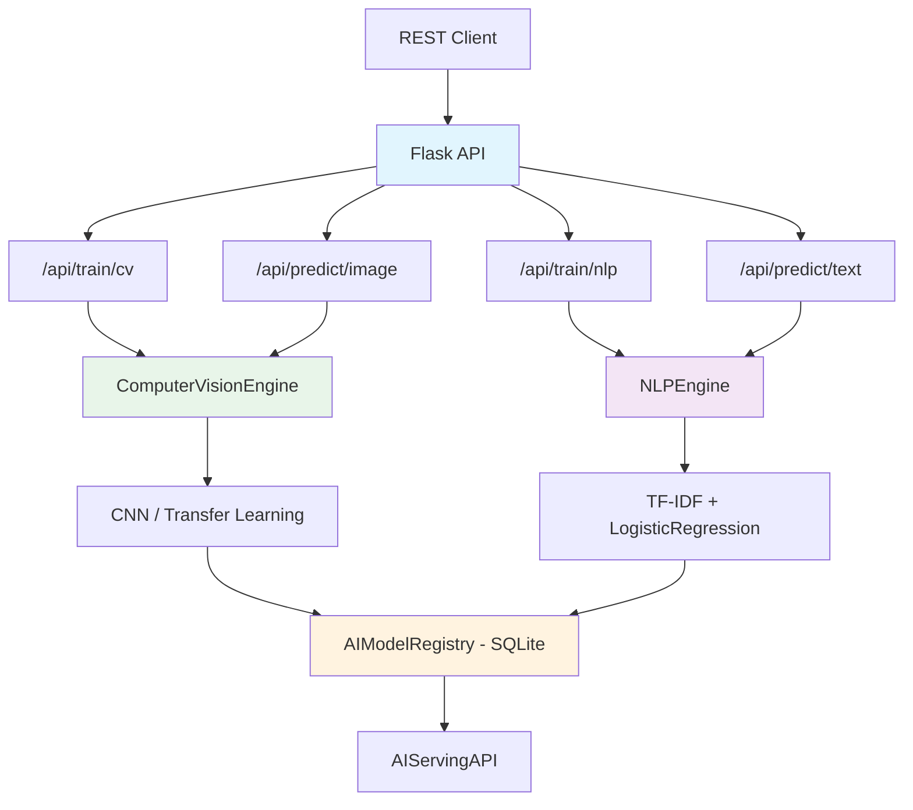

<div align="center">

# IBM AI Engineering Capstone

[](https://python.org)
[](https://www.tensorflow.org/)
[](https://flask.palletsprojects.com/)
[](https://scikit-learn.org/)
[](Dockerfile)
[](LICENSE)

Projeto capstone do IBM AI Engineering Professional Certificate -- plataforma de deep learning e visao computacional com APIs REST para treinamento e inferencia de modelos CNN e NLP.

Capstone project from the IBM AI Engineering Professional Certificate -- deep learning and computer vision platform with REST APIs for training and inference of CNN and NLP models.

[Portugues](#portugues) | [English](#english)

</div>

---

<a name="portugues"></a>
## Portugues

### Sobre

Este projeto foi desenvolvido como capstone da certificacao profissional IBM AI Engineering. A plataforma integra dois motores principais: um de **visao computacional** baseado em redes convolucionais (CNN) com suporte a transfer learning (VGG16, ResNet50, MobileNetV2), e um de **processamento de linguagem natural** com TF-IDF e classificacao de texto. O sistema expoe endpoints REST via Flask para treinar modelos, registrar versoes em banco SQLite e servir predicoes em tempo real. Durante o curso, foram exercitados conceitos de arquitetura de modelos profundos, data augmentation, callbacks de treinamento e deploy de modelos como servicos.

### Tecnologias

| Tecnologia | Descricao |
|---|---|
| Python 3.12 | Linguagem principal |
| TensorFlow / Keras | Framework de deep learning e transfer learning |
| Flask | API REST para treinamento e inferencia |
| scikit-learn | Pipeline NLP (TF-IDF, Logistic Regression) |
| OpenCV | Geracao e manipulacao de imagens sinteticas |
| NumPy / Pandas | Computacao numerica e manipulacao de dados |
| SQLite | Registro de modelos e predicoes |

### Arquitetura


### Estrutura do Projeto

```
ibm-ai-engineering-capstone/
├── src/
│   ├── ai_platform.py          # Motores CV e NLP, registro de modelos, API Flask
│   └── main_platform.py        # Dashboard Streamlit com KPIs e visualizacoes
├── tests/
│   ├── __init__.py
│   ├── performance_test.py
│   └── test_platform.py
├── assets/
├── Dockerfile
├── requirements.txt
├── LICENSE
└── README.md
```

### Inicio Rapido

```bash
# Clonar o repositorio
git clone https://github.com/galafis/ibm-ai-engineering-capstone.git
cd ibm-ai-engineering-capstone

# Criar ambiente virtual
python -m venv venv
source venv/bin/activate  # Windows: venv\Scripts\activate

# Instalar dependencias
pip install -r requirements.txt

# Executar pipeline de treinamento + API
python src/ai_platform.py

# Executar dashboard
streamlit run src/main_platform.py
```

### Docker

```bash
docker build -t ibm-ai-engineering-capstone .
docker run -p 8000:8000 ibm-ai-engineering-capstone
```

### Testes

```bash
pytest
pytest --cov --cov-report=html
pytest tests/test_platform.py -v
```

### Aprendizados

- Construcao de CNNs customizadas e uso de transfer learning com modelos pre-treinados (VGG16, ResNet50, MobileNetV2)
- Pipeline completo de NLP: tokenizacao, lematizacao, TF-IDF e classificacao
- Registro e versionamento de modelos em banco de dados
- Deploy de modelos via API REST com Flask
- Callbacks de treinamento (EarlyStopping, ReduceLROnPlateau) para otimizacao

### Autor

**Gabriel Demetrios Lafis**
- GitHub: [@galafis](https://github.com/galafis)
- LinkedIn: [Gabriel Demetrios Lafis](https://linkedin.com/in/gabriel-demetrios-lafis)

### Licenca

Este projeto esta licenciado sob a [Licenca MIT](LICENSE).

---

<a name="english"></a>
## English

### About

This project was developed as a capstone for the IBM AI Engineering Professional Certificate. The platform integrates two main engines: a **computer vision** engine based on convolutional neural networks (CNN) with transfer learning support (VGG16, ResNet50, MobileNetV2), and a **natural language processing** engine with TF-IDF and text classification. The system exposes REST endpoints via Flask for model training, version registration in an SQLite database, and real-time prediction serving. Throughout the course, concepts such as deep model architectures, data augmentation, training callbacks, and model deployment as services were practiced.

### Technologies

| Technology | Description |
|---|---|
| Python 3.12 | Core language |
| TensorFlow / Keras | Deep learning and transfer learning framework |
| Flask | REST API for training and inference |
| scikit-learn | NLP pipeline (TF-IDF, Logistic Regression) |
| OpenCV | Synthetic image generation and manipulation |
| NumPy / Pandas | Numerical computing and data manipulation |
| SQLite | Model and prediction registry |

### Architecture



### Project Structure

```
ibm-ai-engineering-capstone/
├── src/
│   ├── ai_platform.py          # CV and NLP engines, model registry, Flask API
│   └── main_platform.py        # Streamlit dashboard with KPIs and visualizations
├── tests/
│   ├── __init__.py
│   ├── performance_test.py
│   └── test_platform.py
├── assets/
├── Dockerfile
├── requirements.txt
├── LICENSE
└── README.md
```

### Quick Start

```bash
# Clone the repository
git clone https://github.com/galafis/ibm-ai-engineering-capstone.git
cd ibm-ai-engineering-capstone

# Create virtual environment
python -m venv venv
source venv/bin/activate  # Windows: venv\Scripts\activate

# Install dependencies
pip install -r requirements.txt

# Run training pipeline + API
python src/ai_platform.py

# Run dashboard
streamlit run src/main_platform.py
```

### Docker

```bash
docker build -t ibm-ai-engineering-capstone .
docker run -p 8000:8000 ibm-ai-engineering-capstone
```

### Tests

```bash
pytest
pytest --cov --cov-report=html
pytest tests/test_platform.py -v
```

### Learnings

- Building custom CNNs and using transfer learning with pre-trained models (VGG16, ResNet50, MobileNetV2)
- Full NLP pipeline: tokenization, lemmatization, TF-IDF, and classification
- Model registration and versioning in a database
- Model deployment via REST API with Flask
- Training callbacks (EarlyStopping, ReduceLROnPlateau) for optimization

### Author

**Gabriel Demetrios Lafis**
- GitHub: [@galafis](https://github.com/galafis)
- LinkedIn: [Gabriel Demetrios Lafis](https://linkedin.com/in/gabriel-demetrios-lafis)

### License

This project is licensed under the [MIT License](LICENSE).
